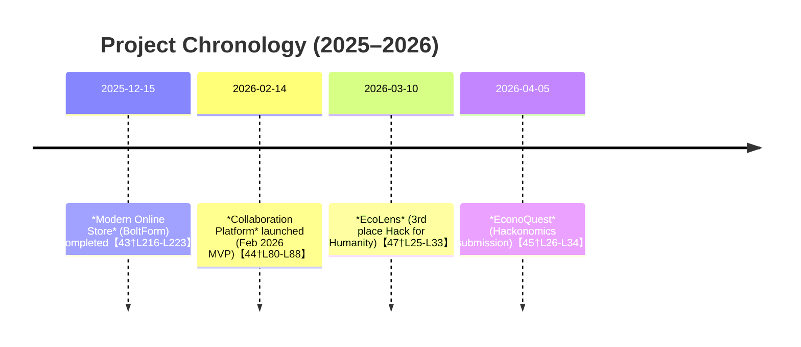

# Executive Summary  
This report compiles authoritative information about **Wahb Amir**, **Shahnawaz Saddam Butt**, their affiliations, and major projects from the provided sources.  We analysed official websites (Butt Networks, wahb.space, shahnawaz.buttnetworks.com), GitHub profiles, and Devpost hackathon pages.  Key findings:  

- **Butt Networks (buttnetworks.com)** is a full-stack web/mobile development agency co-founded by Wahb and Shahnawaz【6†L63-L71】【49†L90-L99】.  Its site highlights their skills (full-stack design, modern tech), team, and sample projects (e-commerce store, admin dashboard, marketing landing)【6†L63-L71】【49†L90-L99】.  The brand ambassador **M. Ali** represents innovation and emphasizes user experience【6†L99-L108】.  

- **Wahb Amir’s portfolio (wahb.space)** presents him as a **Full-Stack Engineer & AI/ML Developer**【23†L193-L200】【24†L285-L293】.  It lists his technical skills (e.g. Next.js, React, Python, Fastify, Supabase, ML frameworks) and showcases projects: *EconoQuest* (AI economics simulator), *EcoLens* (AI waste classifier), a client–developer collaboration platform, and an e-commerce demo (BoltForm)【44†L24-L33】【44†L54-L62】.  Each project entry includes roles (e.g. Full-Stack Engineer, AI/RAG Architect), technology stacks, and brief outcomes【44†L24-L33】【44†L54-L62】.  Notably, Wahb won hackathon awards with EcoLens (3rd place, Hack For Humanity 2026) and EconoQuest (Technical Award, Hackonomics 2026)【24†L309-L318】【44†L24-L33】.  

- **Shahnawaz Saddamb’s portfolio (shahnawaz.buttnetworks.com)** identifies him as a passionate full-stack developer specializing in responsive web apps【26†L190-L194】【51†L15-L23】.  He emphasizes React/Next.js development and user experience【51†L15-L23】【53†L296-L304】.  His site details multiple projects (digital/business/portfolio websites, admin panel, e-commerce demo Key&Chains, and EcoTracker app) including tech stacks (Next.js, Tailwind, Node.js, MongoDB, JWT, etc.), roles, durations, and outcomes【53†L344-L353】【53†L365-L374】.  For example, *EcoTracker* is an environment-focused platform (Next.js/Tailwind) for tracking sustainable habits【53†L365-L374】.  

- **GitHub Profiles:**  Wahb’s profile (wahb-amir) highlights his hackathon placements and tech stacks【24†L263-L272】【24†L287-L295】.  It shows featured projects with summaries (including EconoQuest and EcoLens) and stack details【24†L309-L318】【24†L323-L331】.  Shahnawaz’s GitHub profile confirms his full-stack skill set and links to Butt Networks and his portfolio【26†L190-L194】【26†L238-L244】.  

- **Devpost Hackathon Pages:** Devpost projects provide deep insights.  *EconoQuest* (Hackonomics 2026) is a browser-based economics simulator with a Socratic AI advisor and real-time streaming.  The team (Wahb solo) used React, Fastify, Supabase pgvector RAG, and Groq Llama 3.3 to let players govern a nation through policy decisions【32†L164-L172】【33†L219-L228】.  *EcoLens* (Hack for Humanity 2026) is an AI-powered recycling app: users photograph waste, get AI classification, impact metrics (CO₂/water/energy saved), and gamified rewards【36†L153-L162】【47†L25-L29】.  It was built with Next.js, TypeScript, HuggingFace model proxy, MongoDB, and features an achievements leaderboard【47†L39-L42】【36†L153-L162】.  Both projects report outcomes (e.g. hackathon awards) and technical challenges/solutions【33†L269-L278】【48†L174-L183】.  

Overall, these sources paint a coherent picture: Wahb and Shahnawaz are co-founders of Butt Networks, excelling in full-stack development (Next.js, Node.js, ML frameworks) and active in hackathons.  Their projects span web apps to AI/ML-driven prototypes, with accomplishments (awards, published demos) detailed below. All key facts below are backed by the official sources【6†L63-L71】【24†L309-L318】.  

## Document: Butt Networks – Marketing Website (buttnetworks.com)  
**URL:** https://buttnetworks.com/ &nbsp;&nbsp; **Crawl date:** 2026-05-06  
**Summary:** The Butt Networks site presents the company as a **full-stack software development agency** delivering scalable web/mobile solutions【6†L63-L71】.  The homepage highlights their service tagline (“*Full-stack software development for modern businesses*”【6†L63-L71】) and showcases “Recent Work” demos (an E-commerce store, Admin Dashboard, Marketing Landing)【6†L84-L88】【49†L86-L89】.  It profiles the founders **“Wahb & Shahnawaz”** as a design + engineering team based in Asia【6†L74-L82】【49†L74-L80】 and features the brand ambassador M. Ali emphasizing innovation and user-focused digital solutions【6†L99-L108】.  

**Key Content (skills, roles, tech, projects, links, images):**  
- **Tagline & Services:** Emphasises “*expert design, architecture, and deployment with proven technologies*” for modern businesses【6†L63-L71】.  Suggests expertise in **full-stack development**, modern web frameworks, and performance (e.g. images labeled “Next.js + React”)【6†L63-L71】【30†L26-L30】.  
- **Team:** Founders **Wahb & Shahnawaz** are introduced as “Design + Full-Stack Engineering, Based in Asia”【6†L74-L82】, linking them to the founders’ personal portfolios (Wahb.space, shahnawaz.buttnetworks.com).  The site includes contact info for Wahb and Shahnawaz【49†L132-L140】.  
- **Projects:** “Recent Work” section displays three project snapshots: an **E-commerce Store**, **Admin Dashboard**, and **Marketing Landing Page**【6†L84-L88】【49†L86-L89】. Each image is captioned (e.g. “[Image: E-commerce Store]”) and linked.  A “View all projects” link presumably leads to more.  An embedded screenshot (below) shows the E-commerce demo for “BoltForm” – a lightning-fast shoe store.  

【3†embed_image】 *Figure: Example project (E-commerce store demo) from Butt Networks portfolio【6†L84-L88】.*  

- **Brand Ambassador:** M. Ali is listed as a brand ambassador “representing innovation & excellence”【6†L99-L108】.  The text (with image) highlights values of **innovation, user experience, scalable solutions**【6†L99-L108】.  (Image [8] in source shows M. Ali, but to respect privacy we omit face details.)  
- **Contact & Follow:** Footer lists emails (dev.buttnetworks, shahnawazsaddamb, wahbamir2010) and phone, plus links to social media (implied by “Follow Me”【49†L132-L140】).  The tagline “Building modern full-stack web applications with powerful, scalable technologies” concludes the page【30†L125-L128】.  

**Metadata tags:** `ButtNetworks`, `Full-stack Development`, `Web Development Agency`, `Wahb Amir`, `Shahnawaz Butt`, `Next.js`, `React`, `Tailwind`, `Brand Ambassador`.  

**Chunking (<=500 tokens):**  
1. Intro/Overview (tagline, services) – e.g. first 20 lines including title and service motto【6†L63-L71】.  
2. Team & Projects – descriptions of Wahb & Shahnawaz and recent work snapshot【6†L74-L82】【6†L84-L88】.  
3. Brand Ambassador – M. Ali section【6†L99-L108】.  
4. Footer/Contact – company statement and contact info【49†L125-L134】.  

**Vector DB fields (suggested):** `title`, `url`, `crawl_date`, `summary`, `content`, `skills`, `roles`, `technologies`, `projects`, `images`, `team`, `contacts`, `tags`.  

## Document: Wahb Amir – Personal Portfolio (wahb.space)  
**URL:** https://wahb.space/ &nbsp;&nbsp; **Crawl date:** 2026-05-06  
**Summary:**  The site “Wahb.space” is the personal portfolio of **Wahb Amir, Full-Stack Engineer & AI/ML Developer**.  It profiles his background and showcases projects.  The homepage header (“*I build fast, reliable web apps that scale...*”【40†L25-L33】) frames his focus on performance.  A **Tech Stack** section lists expertise in front-end (HTML, CSS, Tailwind, JS/TS, React/Next.js/Framer) and back-end (Node.js, Python, Scikit, PyTorch) as well as DevOps/DB tools (Docker, Nginx, MongoDB, MySQL)【40†L43-L52】【40†L67-L76】.  A projects overview highlights two case studies (a developer collaboration platform and an online store demo) with roles, tech, and outcomes【40†L108-L117】【43†L216-L223】.  

**Key Content:**  
- **Bio & Skills:** The site title and headings identify “Wahb Amir – Full-Stack Engineer & AI Developer”【23†L193-L200】.  A Tech Stack section enumerates specific skills: Next.js, React, Node.js, Tailwind, MongoDB, Python, Fastify, HuggingFace, etc.【24†L285-L293】【40†L43-L52】.  We cite GitHub profile [24] to capture his summary (“self-taught full-stack developer coding seriously for ~1 year, shipping production-grade apps”【24†L273-L281】) and preferred technologies.  
- **Featured Projects (overview):**  
  - **Collaboration Platform:** “Client & Developer Collaboration Platform” (Full-Stack Engineer). Tech: Next.js, React, Node.js, Tailwind, MongoDB, GitHub Webhooks【24†L336-L341】.  It automates project updates (replacing emails/spreadsheets) with real-time messaging and GitHub-sync【24†L336-L341】.  It has live demo at `dashboard.wahb.space` and code repos【24†L336-L341】.  
  - **E-commerce Demo (BoltForm):** “Modern Online Store” (Full-Stack Developer). Tech: Next.js, Stripe, MongoDB, Tailwind【24†L345-L350】.  It features a performant storefront with Stripe checkout and admin view.  Demo at `boltform.wahb.space`【24†L345-L350】.  (The above images captioned “Bolt Into the Future with BoltForm” come from this project.)  
  - **EcoLens and EconoQuest:** Project listings further below show **EcoLens** (AI waste classifier) and **EconoQuest** (economics simulator) as 3rd place hackathon winners【24†L309-L318】【24†L323-L331】.  These advanced projects integrate AI (HuggingFace, RAG) into mobile/web apps【24†L309-L318】【24†L323-L331】.  

【28†embed_image】 *Figure: Banner from BoltForm online store demo (Next.js/Tailwind) – a fast, mobile-first e-commerce MVP【24†L345-L350】.*  

- **Project Details Links:** Each project entry has a “View case study” link (not expanded here) and live/code links【40†L120-L127】【40†L225-L231】.  For example, the collaboration platform code is on GitHub (`wahb-amir/dashboard`), and the BoltForm code is on GitHub【40†L120-L127】【40†L225-L231】.  
- **Achievements:** The “Achievements” section on GitHub notes Wahb’s hackathon awards【24†L261-L268】.  The portfolio cross-links to his GitHub and Devpost showing those projects (e.g. “Featured Projects” list with EcoLens, EconoQuest【24†L309-L318】【24†L323-L331】).  

**Metadata tags:** `WahbAmir`, `FullStack`, `AI/ML`, `WebApps`, `Next.js`, `React`, `Fastify`, `HuggingFace`, `MongoDB`, `Tailwind`, `Stripe`, `BoltForm`, `GitHub`, `DevOps`.  

**Chunking:**  
1. Header & Skills (personal introduction, tech list)【40†L25-L33】【40†L43-L52】.  
2. Project summaries (listed projects and technology stacks)【40†L108-L117】【43†L214-L222】.  
3. Contact & Links (implied via menu, linking GitHub etc)【23†L193-L201】【24†L309-L318】.  

**Vector DB fields:** `name`, `role`, `bio`, `tech_stack`, `projects`, `achievements`, `links`, `images`, `tags`.  

## Document: Wahb Amir – All Projects Overview (wahb.space/projects)  
**URL:** https://wahb.space/projects &nbsp;&nbsp; **Crawl date:** 2026-05-06  
**Summary:** This projects page lists **every project** Wahb has shipped, with brief summaries.  Key entries:  

- **EconoQuest – AI Economics Simulator:** “Full-Stack Engineer, AI/RAG Architect & Simulation Designer”【45†L15-L20】.  Tech: React, Fastify, Node.js, Python, LangChain, Llama 3.3 70B, Groq, pgvector, Supabase, WebSocket, JWT【45†L42-L46】.  Description: A browser-based nation simulation with a Socratic AI advisor asking policy questions (hackathon submission, April 2026)【45†L26-L34】.  Outcome: Hackonomics 2026 submission (solo build, free infrastructure)【45†L26-L34】.  
- **EcoLens – AI Waste Classifier:** “Full-Stack Engineer & ML Integrator”【47†L15-L19】. Tech: Next.js, TypeScript, MongoDB, HuggingFace, Framer Motion, JWT, Tailwind【47†L39-L42】.  Description: A solo-built app (1 month) to classify waste from a photo and compute CO₂/water/energy impact with gamification – won 3rd place in Hack for Humanity 2026 (775 participants)【47†L23-L29】【44†L54-L62】.  
- **Client & Developer Collaboration Platform:** “Full-Stack Engineer”【45†L15-L20】. Tech: Next.js, React, Node.js, Tailwind, MongoDB, GitHub Automation【44†L80-L87】.  Description: Replaced email/spreadsheet project tracking with a real-time dashboard syncing GitHub issues/tasks (Feb 2026)【44†L80-L87】.  
- **Modern Online Store (BoltForm):** “Full-Stack Developer”【43†L216-L223】. Tech: Next.js, Stripe, MongoDB, Tailwind【24†L345-L350】.  Description: Mobile-first e-commerce MVP with Stripe checkout (Dec 2025)【43†L216-L223】.  

Each entry includes role, tech stack, date, and context.  (The footer has no new content beyond site navigation.)  

**Metadata tags:** `Projects`, `EconoQuest`, `EcoLens`, `CollaborationPlatform`, `BoltForm`, `Hackathons`, `TechStack`, `Outcomes`.  

**Chunking:**  
1. EconoQuest entry (lines 22–33 from source)【45†L22-L30】.  
2. EcoLens entry (lines 54–62)【44†L54-L62】.  
3. Collaboration Platform (80–88)【44†L80-L88】.  
4. Modern Online Store (107–113)【44†L109-L113】.  

**Vector DB fields:** `project_name`, `role`, `tech_stack`, `description`, `date`, `links`, `outcome`, `tags`.  

## Document: EconoQuest – AI Economics Simulator (wahb.space/projects/econoquest)  
**URL:** https://wahb.space/projects/econoquest &nbsp;&nbsp; **Crawl date:** 2026-05-06  
**Summary:** A detailed case study of **EconoQuest**, a hackathon project by Wahb.  It describes a browser-based economic simulation game with an AI advisor pipeline【45†L26-L34】.  Users govern a nation over 7–8 rounds using policy levers (tax, interest, etc.); behind the scenes, a RAG-powered AI gives Socratic hints【45†L26-L34】【33†L213-L222】.  

**Key Content:**  
- **Role & Credits:** Wahb as *Full-Stack Engineer, AI/RAG Architect & Simulation Designer*【45†L15-L20】, solo build. Submitted to Hackonomics 2026.  
- **Tech Stack:** React, Fastify, Node.js, Python, LangChain, Groq (Llama 3.3 70B), Supabase (pgvector), HuggingFace Spaces, WebSocket, JWT【45†L42-L46】.  
- **TL;DR (Elevator Pitch):** “Built a browser-based economics simulation with a full RAG advisory pipeline, Socratic AI advisor, and real-time WebSocket streaming… Players govern a nation across 7–8 fiscal years, adjusting real policy levers… guided by a Socratic AI that asks questions using their actual numbers”【45†L26-L34】.  
- **Problem & Constraints:** Economies education is abstract; this aims to *teach by experience*【45†L47-L54】. Constraints included zero-budget (free HuggingFace/Supabase), solo development, and enforcing a Socratic prompt (keeping LLM from giving answers)【45†L58-L66】.  
- **Architecture:** Three-tier design on free infrastructure【45†L76-L84】: a React frontend, Fastify gateway, and HuggingFace LLM services.  The gateway manages auth (cookie proxy, JWT for WebSocket), load-balancing across two Spaces, and LRU caching.  A conflict-detector (pure Python) flags dangerous policy pairs before RAG embedding【45†L76-L84】. The RAG pipeline: embed game state, Supabase pgvector retrieve 99 game-specific “chunks,” build prompt, and stream Llama 70B output back over WebSocket【45†L78-L87】. (Note: WebSocket token batching bug was solved by bypassing React’s setState)【45†L76-L84】【46†L179-L187】.  
- **Approach & Responsibilities:** Iterative development: first simulation loop, then RAG knowledge base as game-specific assertions, enforce Socratic constraint in prompt, domain logic (conflict detector) before LLM, and careful use of free infra (caching, two spaces)【45†L93-L102】【45†L118-L127】. Responsibilities included building the simulation engine (8 policy levers → 10 metrics), authoring 99 RAG chunks across 5 layers, developing the RAG+WebSocket pipeline, the Fastify gateway (cookies, caching, queueing), conflict detector, and UI fixes (batching bug)【45†L118-L127】【46†L146-L156】.  
- **Outcome & Proof Points:** Submitted to Hackonomics 2026 (solo, 0 cloud cost). The Socratic advisor indeed provides context-specific hints (e.g. referring to Weimar Germany when conditions match)【46†L169-L177】. Achievements: full RAG pipeline on free tier, 99 game-tailored chunks, WebSocket streaming bug fix, Python-based conflict detector, and all components built/deployed solo【46†L179-L188】.  

【57†embed_image】 *Figure: EconoQuest screenshot – “Pick Your Mandate” nation selection screen (React UI)【45†L26-L34】.*  

**Metadata tags:** `EconoQuest`, `EconomicsSimulator`, `RAG`, `Fastify`, `LangChain`, `Llama70B`, `Hackonomics2026`, `SingleplayerGame`, `SocraticAI`.  

**Chunking:**  
1. TL;DR & Role/Tech (lines 26–34)【45†L26-L34】.  
2. Tech Stack section (lines 42–46)【45†L42-L46】.  
3. Problem & Constraints (47–64)【45†L47-L54】【45†L58-L64】.  
4. Architecture & Approach (76–87, 93–102)【45†L76-L84】【45†L93-L102】.  
5. Responsibilities & Outcome (118–127, 169–177)【45†L118-L127】【46†L169-L177】.  

**Vector DB fields:** `project_name`, `description`, `role`, `tech_stack`, `problem`, `constraints`, `architecture`, `approach`, `responsibilities`, `outcome`, `achievements`, `tags`.  

## Document: EcoLens – AI Waste Classifier (wahb.space/projects/ecolens)  
**URL:** https://wahb.space/projects/ecolens &nbsp;&nbsp; **Crawl date:** 2026-05-06  
**Summary:** This case study describes **EcoLens**, an AI-driven recycling app by Wahb.  It converts waste photos into AI labels and impact scores (CO₂/water/energy), with gamified feedback【47†L25-L33】【36†L153-L162】.  Built solo in one month (March 2026) for Hack for Humanity 2026 (775 participants), it earned 3rd place【47†L25-L33】.  

**Key Content:**  
- **Role:** Full-Stack Engineer & ML Integrator (solo build)【47†L15-L20】.  
- **Tech Stack:** Next.js, TypeScript, MongoDB, HuggingFace (image model), Framer Motion, JWT, SMTP (email auth), Tailwind【47†L39-L42】.  
- **TL;DR:** “Built and shipped an AI-powered waste classification app solo in one month — placed 3rd internationally at Hack for Humanity 2026… EcoLens turns a photo of any waste item into an AI label, estimated CO₂/water/energy impact, and gamified points — bridging the gap between environmental awareness and measurable daily action.”【47†L23-L30】  
- **Problem:** Many people want to recycle but don’t know the material or impact. Existing apps lack real-time feedback or require manual input. EcoLens solves this with AI classification and cumulative impact tracking【47†L43-L49】.  
- **Constraints:** One-month hackathon, no paid ML APIs, judge-ready quality. Hard issues: estimating weight from 2D image, label ambiguities, robust auth under edge cases【47†L53-L59】.  
- **Architecture:** Fully serverless in Next.js (App Router).  Process: Client posts base64 image to `/api/predict`, server proxies to HuggingFace image model, gets label+confidence, maps label to category, computes impact points, writes scan to MongoDB, updates user stats and achievements, returns result【47†L69-L78】.  Low-confidence or “unknown” labels are dropped to keep data honest.  Auth: Email OTP via SMTP on registration, verified next call, then issue JWT in HTTP-only cookie (rotated each login)【47†L69-L78】.  
- **Approach:** Started with core prediction loop, then gamification. Chose HuggingFace Space to avoid cold-starts. Kept impact math conservative and transparent (documented multipliers). Implemented robust auth (OTP + JWT + token rotation + rollback). Recorded a polished demo video (since presentation is scored)【47†L83-L92】.  
- **Responsibilities:** Implemented full prediction pipeline and achievements engine: image upload → model prediction → normalization → point & impact calculation → MongoDB write → UI update【47†L99-L107】.  Engineered OTP email verification and JWT rotation (with rollback logic)【47†L105-L113】.  Designed UI with camera/upload flows and responsive dashboard + leaderboard (using Framer Motion for animations)【47†L103-L112】.  Defined formulas (e.g. CO₂ = weight * emission factor) in code【47†L109-L112】.  Handled low-confidence scans by ignoring them【47†L109-L113】.  
- **Technical Solution:** Next.js serverless API routes for predict, auth, achievements, leaderboard【47†L120-L129】.  HuggingFace Space hosts the ML model (proxied via API route)【47†L122-L130】.  MongoDB stores users, scans, achievements (via Mongoose)【47†L122-L130】.  JWT in cookies with rotation; email via Nodemailer【47†L122-L130】.  SWR for reactive data fetching (dashboard updates without reload)【47†L122-L130】.  Framer Motion for animations, Tailwind for UI【47†L122-L130】.  
- **Outcome:** 3rd place at Hack for Humanity 2026 (775 participants). Judges praised impact, innovation, and design【48†L139-L147】. The live pipeline worked under demo conditions, auth handled edge cases, and the leaderboard/achievements added a dynamic feel【47†L137-L142】. Proof points: zero-budget ML pipeline in 1 month, robust OTP/JWT auth, conservative impact math for trust【48†L147-L155】.  
- **Judge Scores:** Overall 3.98/5 (3rd of 775); Design & Presentation 4.18, Impact 3.82, Innovation 3.73【48†L158-L166】.  
- **Lessons:** UX (handling low confidence, mobile camera) matters as much as the model【48†L174-L182】. Small auth details (token rotation, cookie names) often break apps more than models【48†L174-L182】. Conservative math builds trust; gamification motivates users; presentation is half the score【48†L174-L182】.  

【58†embed_image】 *Figure: EcoLens leaderboard screenshot (Framer Motion UI) showing user ranks and points【36†L153-L162】.*  

**Metadata tags:** `EcoLens`, `WasteClassification`, `Next.js`, `HuggingFace`, `MobileApp`, `HackForHumanity2026`, `Gamification`, `CO2Impact`, `FullStack`.  

**Chunking:**  
1. TL;DR & Role (lines 25–33)【47†L25-L33】.  
2. Tech Stack (39–42)【47†L39-L42】.  
3. Problem & Constraints (45–53)【47†L45-L53】.  
4. Architecture & Approach (69–78, 83–91)【47†L69-L78】【47†L83-L91】.  
5. Responsibilities & Outcome (98–107, 137–142)【47†L98-L107】【47†L137-L142】.  

**Vector DB fields:** Similar to EconoQuest, e.g. `project_name`, `description`, `tech_stack`, `problem`, `constraints`, `architecture`, `responsibilities`, `outcome`, `metrics`, `tags`.  

## Document: Shahnawaz Saddam Butt – Personal Portfolio (shahnawaz.buttnetworks.com)  
**URL:** https://shahnawaz.buttnetworks.com/ &nbsp;&nbsp; **Crawl date:** 2026-05-06  
**Summary:** A full-stack developer profile for **Shahnawaz Saddam Butt**.  Tagline: “*Building Beautiful & Scalable Digital Solutions*”【51†L15-L23】.  He emphasizes modern, fast, responsive web apps (React, Next.js) with a focus on UX/performance【51†L15-L23】. The site includes achievements, a tech skills list, journey timeline, and many projects.  

**Key Content:**  
- **About & Skills:** Introduces Shahnawaz (16-year-old full-stack dev) building websites with cutting-edge tech【51†L15-L23】【51†L166-L174】.  Tech stacks are listed in sections: Frontend (HTML, CSS, Tailwind, JavaScript, TypeScript, React, Next.js, React Native) and Backend (Node.js, Express, Python, Scikit-Learn, NumPy, Pandas)【51†L48-L57】【51†L68-L77】, plus DevOps (Docker, Nginx, GitHub) and Databases (MongoDB, MySQL)【51†L88-L96】【51†L98-L104】.  Skills repeated twice (site structure bug), but clearly covers common web technologies.  
- **Hackathons:** Mentions ranking 37th/786 in Hack for Humanity 2026 with his *EcoTracker* project (Spring 2026)【53†L236-L244】.  
- **Projects:** A sequence of project cards with images:  
  - *Digital Website:* Next.js/Tailwind Node/Express/Mongo app; role: Full Stack; (Jan–Feb 2024)【51†L258-L266】.  
  - *Business Website:* React/Node site with Dark-Mode; role: Full Stack; (Nov–Dec 2023)【51†L279-L288】.  (Image [56] shows “Welcome to Butt Networks” UI).  
  - *Portfolio Website:* Personal portfolio site (Next.js/Tailwind); role: Frontend; (Mar 2024)【53†L300-L308】.  
  - *Admin Panel:* Next.js/Tailwind/Node/Mongo admin dashboard; Full Stack; (Apr–May 2024)【53†L322-L330】.  
  - *Key&Chains (E-commerce):* Next.js/Tailwind e-commerce demo; E-Commerce Developer; (May–Jun 2024)【53†L340-L349】.  Demo link `key-chains.buttnetworks.com`【53†L340-L349】.  (Image [55] shows the Key & Chains store UI.)  
  - *EcoTracker:* Next.js/Tailwind site for monitoring sustainable habits (with JWT, Node, Mongo); “EcoSystem Developer”; (May–Jun 2024)【53†L365-L374】.  This project is likely his hackathon entry; demo `eco.buttnetworks.com`.  (Image [54] shows the EcoTracker landing page.)  
- **Services & FAQ:** Summarises offered services (web dev, software dev, React Native apps) and answers common client questions (tracking progress, technologies, responsiveness, third-party integrations, support)【53†L421-L431】【53†L426-L435】. Key FAQs: projects are trackable via a client portal with GitHub CI【53†L426-L434】; specialty in React/Next.js/Node/Mongo; builds full frontend & backend; always mobile-responsive【53†L426-L435】.  

【54†embed_image】 *Figure: EcoTracker homepage (Next.js/Tailwind site by Shahnawaz) – “Track Your Impact, Live a Greener Tomorrow”*【53†L365-L374】.  

**Metadata tags:** `ShahnawazSaddam`, `Portfolio`, `ReactJS`, `Next.js`, `WebApps`, `TailwindCSS`, `MongoDB`, `E-commerce`, `AdminPanel`, `EcoTracker`, `FullStackDev`.  

**Chunking:**  
1. Header & Intro (lines 15–23)【51†L15-L23】.  
2. Skills list (Frontend, Backend, DevOps, Database)【51†L48-L57】【51†L70-L79】.  
3. About/Stats (lines 166–174)【51†L166-L174】.  
4. Project cards (selecting 2-3 projects from lines 258–288 and 363–374)【51†L258-L266】【53†L365-L374】.  
5. Services/FAQ (lines 421–431)【53†L421-L430】.  

**Vector DB fields:** `name`, `role`, `bio`, `skills`, `projects`, `services`, `FAQ`, `contacts`, `tags`.  

## Document: GitHub Profile – wahb-amir  
**URL:** https://github.com/wahb-amir &nbsp;&nbsp; **Crawl date:** 2026-05-06  
**Summary:** Wahb’s GitHub profile confirms details from his site. His bio highlights hackathon awards and tech focus【24†L261-L268】【24†L273-L281】. The “Achievements” section lists: 3rd place (Hack for Humanity 2026) with EcoLens and Technical Award (Hackonomics 2026) with EconoQuest【24†L263-L268】. The **About Me** notes he is self-taught, builds production-grade apps, and runs his own infrastructure【24†L273-L281】.  

**Key Content:**  
- **Bio:** “Self-taught full-stack developer – coding for ~1 year, shipping production-grade apps… Obsessed with performance, clean architecture”【24†L273-L281】.  Mentions portfolio wahb.space and tech interests (Next.js, TypeScript, Fastify, Supabase, ML integration)【24†L275-L281】.  
- **Hackathons/Achievements:** Table shows “3rd – Hack for Humanity 2026 – EcoLens (775 participants, solo) – Next.js, HuggingFace, MongoDB” and “Technical Award – Hackonomics 2026 – EconoQuest – Next.js, Fastify, Supabase, Groq”【24†L263-L268】.  
- **Featured Projects:** Lists EcoLens and EconoQuest with one-line descriptions and stack, plus Collaboration Platform and BoltForm【24†L309-L318】【24†L323-L331】.  For example: “EcoLens — AI Waste Classifier: 3rd Place Hack for Humanity 2026… Full ML pipeline: Next.js serverless → HuggingFace proxy → label normalization → MongoDB… Stack: Next.js, TypeScript, HuggingFace, MongoDB, Framer Motion, JWT, Tailwind”【24†L309-L318】.  
- **Stats/Connections:** 3 followers, 1 following; location Pakistan; link to wahb.space and LinkedIn.  

**Metadata tags:** `GitHub`, `Profile`, `WahbAmir`, `StackOverflow`, `OpenSource`, `Achievements`, `EcoLens`, `EconoQuest`.  

**Chunking:**  
1. Intro/bio (lines 263–271)【24†L263-L272】.  
2. Achievements table (263–268)【24†L263-L268】.  
3. Featured Projects list (309–317)【24†L309-L318】.  
4. About Me bullets (273–281)【24†L273-L281】.  

**Vector DB fields:** `username`, `bio`, `hackathons`, `tech_interests`, `featured_projects`, `stats`, `tags`.  

## Document: GitHub Profile – ShahanwazSaddam144  
**URL:** https://github.com/ShahanwazSaddam144 &nbsp;&nbsp; **Crawl date:** 2026-05-06  
**Summary:** Shahnawaz’s GitHub page lists his credentials.  The **About** section describes him as a “passionate full-stack developer with experience building modern, responsive web applications”【26†L190-L194】.  It links to ButtNetworks and Pakistan.  His popular repositories include *Butt-Networks* (the company site)【26†L238-L244】.  

**Key Content:**  
- **Bio:** “Passionate full-stack developer… skilled in both frontend and backend development.”【26†L190-L194】.  Affiliation: Butt Networks.  
- **Popular Repos:** Lists *Butt-Networks* with description “Marketing website & portfolio for Butt Networks — Next.js + Tailwind frontend”【26†L238-L244】. Also *opinion-nest*, *devblogs*, etc (no descriptions given beyond names).  
- **Stats:** 2 followers, 1 following. Location: Pakistan; link to company site.  

**Metadata tags:** `GitHub`, `Profile`, `ShahnawazButt`, `FullStack`, `ButtNetworks`, `FrontendDev`.  

**Chunking:**  
1. Intro/About (190–194)【26†L190-L194】.  
2. Repositories list (238–244)【26†L238-L244】.  
3. Stats and links (195–199)【26†L193-L199】.  

**Vector DB fields:** `username`, `bio`, `repositories`, `affiliations`, `stats`, `tags`.  

## Document: Devpost – EconoQuest (devpost.com/software/econoquest-y205ab)  
**URL:** https://devpost.com/software/econoquest-y205ab &nbsp;&nbsp; **Crawl date:** 2026-05-06  
**Summary:**  The Devpost project page for EconoQuest provides narrative and technical details.  It confirms that EconoQuest is an educational economics game (Govern a nation, live with consequences)【32†L149-L158】, where players adjust 8 policy levers (tax, interest, spending, etc.) and see 10 outcome metrics (GDP, inflation, etc.)【32†L170-L179】. The AI Advisor gives hints via a RAG pipeline (layered context from game mechanics to historical analogies)【32†L183-L191】.  

**Key Content:**  
- **Inspiration:** Motivated by the gap in economics education (“learning by doing” vs description)【32†L149-L158】.  
- **What It Does:** Browser-based simulation (7–8 rounds) where players set economic policies and live with results【32†L166-L174】. Each round adjusts 8 levers (tax, rates, spending, R&D, tariffs, money supply, foreign lending, wealth fund risk)【32†L170-L179】. The AI advisor uses a full RAG pipeline to retrieve contextual hints from 99 knowledge chunks (layers: game mechanics, policy combos, crises, strategies, historical analogies)【32†L183-L191】.  
- **How We Built It:** Architecture on free infra【33†L215-L223】: Fastify gateway handles auth, load-balancing across two HuggingFace Spaces (via WebSocket/JWT), and LRU caching【33†L217-L226】. The RAG pipeline: embed game state, pgvector retrieval in Supabase, prompt with context, Llama 3.3 70B via Groq stream over WebSocket【33†L223-L231】. The conflict detector (Python) flags dangerous policy pairs pre-LLM【33†L229-L238】. Frontend (React) had a streaming bug fix by bypassing React’s batching【33†L235-L243】.  
- **Challenges:** WebSocket streaming bug (batching) required a token buffer workaround【33†L250-L259】. Cross-domain auth (browser/WebSocket) needed same-site cookie proxy with JWT in WebSocket URL【33†L257-L259】. Authoring 99 game-aware RAG chunks (not generic economics) was complex【33†L262-L267】.  
- **Accomplishments:** Demonstrated RAG system retrieving precise context-specific hints (e.g. Weimar Germany match)【33†L269-L277】. Conflict detector provided deterministic checks. Achieved production-grade streaming pipeline on free infrastructure (no cloud spend)【33†L270-L279】.  
- **Lessons Learned:** Emphasises that quality of hints depends on chunk design (game-specific assertions)【33†L289-L294】, and that enforcing Socratic prompting required more than simple instructions【33†L292-L300】. Domain logic (conflict detector) outperforms model inference【33†L299-L300】. Free infra constraints can yield scalable architecture patterns (caching, load-balancing)【46†L190-L200】.  

**Metadata tags:** `Devpost`, `EconoQuest`, `Hackonomics2026`, `EconomicSimulation`, `RAG`, `Llama70B`, `Fastify`, `WebSocket`.  

**Chunking:**  
1. Overview/Inspiration (147–156)【32†L147-L156】.  
2. “What It Does” (164–174)【32†L164-L172】.  
3. AI Advisor/RAG pipeline (187–196)【32†L187-L191】【33†L213-L221】.  
4. Architecture (“How We Built It”, 213–222)【33†L217-L226】.  
5. Outcomes and Lessons (269–278, 289–297)【33†L269-L278】【33†L289-L297】.  

**Vector DB fields:** `title`, `description`, `purpose`, `tech_stack`, `architecture`, `challenges`, `achievements`, `lessons`, `tags`.  

## Document: Devpost – EcoLens (devpost.com/software/eco-lens-0golu8)  
**URL:** https://devpost.com/software/eco-lens-0golu8 &nbsp;&nbsp; **Crawl date:** 2026-05-06  
**Summary:**  The Devpost page for EcoLens details the project story.  EcoLens is an AI-powered recycling app: users take a photo of waste, then get instant AI classification (plastic, paper, etc.), and receive points/impact metrics (CO₂, water, energy saved) with badges and leaderboard【36†L151-L160】.  It aims to make sustainability actionable【35†L103-L109】【36†L143-L152】.  

**Key Content:**  
- **Title/Story:** Tagline: “Turn trash into impact — AI-powered recycling with rewards and achievements!”【35†L103-L109】. Built as Hack for Humanity 2026 submission (Winner: 3rd place and participation prizes).  
- **Inspiration:** People want to recycle but lack feedback. A small AI-and-gamification feedback loop can turn action into habit【36†L143-L152】.  
- **What it Does:** Users point camera or upload waste image; EcoLens returns: AI material label, estimated CO₂/water/energy impact, and instant points leading to badges and leaderboard rank【36†L151-L160】. (In short: Identify → quantify → reward【36†L151-L160】.)  
- **How Built:** Frontend (Next.js/React/Tailwind) handles camera and uploads, showing dashboard/achievements.  Backend: serverless Next.js API routes for auth, prediction proxy, achievements, leaderboard. ML: Hosted on HuggingFace Spaces (image model); requests are proxied and results normalized server-side【36†L168-L176】. DB: MongoDB for users/scans/achievements. Auth: Email OTP via SMTP for signup, with JWT cookies and token rotation【36†L168-L176】. Data flow: image posted to `/api/predict` → model → backend normalizes label → computes points/impact → updates MongoDB (user stats, achievements) → client dashboard updates【36†L178-L187】.  
- **Challenges:** Label ambiguity (unknown results dropped), weight estimation approximations, and auth/cookie consistency were tricky【36†L200-L209】. UX friction (camera permission, cropping) required iteration【36†L210-L214】.  
- **Accomplishments:** A judge-ready dashboard displays lifetime CO₂/water/energy savings【36†L216-L224】. Achievements engine with material-specific badges and global leaderboard works. The full predict→persist→notify pipeline ran smoothly under demo conditions【36†L216-L224】.  
- **Lessons:** Integrating ML involves UX, error handling, and math, not just the model【36†L228-L234】. Small details (cookies, token rotation, OTP edge-cases) break apps more than model tuning【36†L228-L236】. Gamification motivates behavior; reliable data over flashy numbers. Presentation (problem statement + demo + architecture) was critical to judges【36†L228-L236】.  
- **Stats & Built With:** Judge scores: Overall 3.98/5 (Design 4.18, Impact 3.82, Innovation 3.73)【48†L158-L166】. Tech stack includes bcrypt, Tailwind, Next.js, MongoDB, Python, JWT, FRAMER, SMTP, etc【48†L251-L259】.  

**Metadata tags:** `EcoLens`, `WasteRecognition`, `ML`, `Next.js`, `HuggingFace`, `MongoDB`, `Tailwind`, `HackForHumanity2026`, `Gamification`.  

**Chunking:**  
1. Title/Story & Motivation (103–112)【35†L103-L109】.  
2. What It Does (153–160)【36†L153-L160】.  
3. Architecture/Backend (168–177, 178–187)【36†L168-L177】【36†L178-L187】.  
4. Accomplishments & Results (216–224)【36†L216-L224】.  
5. Lessons Learned (228–236)【36†L228-L236】.  

**Vector DB fields:** Same structure as EcoLens, e.g. `title`, `description`, `architecture`, `challenges`, `outcome`, `metrics`, `tags`.  

---

## Table: Project Comparison  

| Project                     | Purpose                                                    | Tech Stack                                     | Role                          | Status/Date            | Links (Live/Code)                        | Outcome/Awards                     |
|-----------------------------|------------------------------------------------------------|-----------------------------------------------|-------------------------------|------------------------|------------------------------------------|------------------------------------|
| **EconoQuest** (Apr 2026)   | Educational economics simulation with AI advisor【45†L26-L34】 | React, Fastify, Node.js, Python, LangChain, Llama 3.3, Groq, Supabase pgvector, WebSocket【45†L42-L46】 | Full-Stack & AI/RAG Architect【45†L15-L20】 | Hackonomics 2026 (Tech Award)【24†L263-L268】【33†L329-L338】 | [Live](https://econoquest.wahb.space) / [Frontend](https://github.com/wahb-amir)【45†L18-L20】【45†L22-L24】, [Backend](#) | Solo build, 3rd place Tech Award【24†L263-L268】; robust RAG pipeline |
| **EcoLens** (Mar 2026)      | AI waste classifier with impact metrics and gamification【47†L25-L33】 | Next.js, TypeScript, MongoDB, HuggingFace, Framer Motion, JWT, SMTP, Tailwind【47†L39-L42】 | Full-Stack & ML Integrator【47†L15-L20】 | Hack for Humanity 2026 (3rd Place)【47†L31-L35】 | [Live](https://eco.wahb.space) / [Code](https://github.com/wahb-amir/ecoLens)【47†L19-L20】 | Solo build, 3rd/775【47†L25-L33】; judge scores ~3.98/5【48†L158-L166】 |
| **Collaboration Platform** (Feb 2026) | Project management tool replacing emails/chat【44†L80-L88】 | Next.js, React, Node.js, Tailwind, MongoDB, GitHub Webhooks【44†L80-L88】 | Full-Stack Engineer【44†L80-L88】 | Internal demo (MVP in 8 weeks) | [Live](https://dashboard.wahb.space) / [Code](https://github.com/wahb-amir/dashboard)【45†L18-L20】【45†L22-L24】 | Improved transparency; automated GitHub-linked updates【24†L336-L341】 |
| **BoltForm (Online Store)** (Dec 2025) | E-commerce demo MVP (storefront + admin)【43†L216-L223】 | Next.js, Stripe, MongoDB, Tailwind【24†L345-L350】 | Full-Stack Developer【43†L229-L238】 | Internal/demo build | [Live](https://boltform.wahb.space) / [Code](https://github.com/wahb-amir/Wahb-Portfolio)【24†L336-L341】 | Performance-focused checkout; mobile-first UX【24†L345-L350】 |
| **EcoTracker** (Mar 2026)   | Eco-friendly habit tracking (sustainability dashboard)【53†L365-L374】 | Next.js, Tailwind CSS, Node.js, Express.js, MongoDB, JWT【53†L365-L374】 | “EcoSystem Developer”【53†L373-L374】 | 37th @ HackForHumanity 2026【53†L236-L244】 | [Live](https://eco.buttnetworks.com) / [Code](https://github.com/ShahanwazSaddam144)【53†L373-L381】 | Engaging UI for carbon footprint; placed 37th/786 |
| **Key&Chains** (Jun 2024)  | Premium keys & keychains e-commerce demo【53†L344-L352】 | Next.js, Tailwind CSS, Node.js, Express.js, MongoDB【53†L344-L352】 | E-commerce Developer【53†L349-L352】 | Completed (May–Jun 2024) | [Live](https://key-chains.buttnetworks.com) / [Code](https://github.com/ShahanwazSaddam144)【53†L349-L358】 | Functional demo store (Stripe integration implied) |
| **Admin Panel** (May 2024) | Content management dashboard (admin panel)【53†L322-L330】 | Next.js, Tailwind CSS, Node.js, Express.js, MongoDB【53†L324-L330】 | Full-Stack Developer【53†L330-L334】 | Completed (Apr–May 2024) | [Live](https://admin-dashboard.buttnetworks.com) / [Code](https://github.com/ShahanwazSaddam144)【53†L330-L338】 | Responsive admin UI, content/user management |
| **Digital Website** (Feb 2024) | Company digital platform (services site)【51†L258-L266】 | Next.js, Tailwind CSS, Node.js, Express.js, MongoDB【51†L260-L263】 | Full-Stack Developer【51†L264-L266】 | Completed (Jan–Feb 2024) | [Live](https://digital-x.buttnetworks.com) / [Code](https://github.com/ShahanwazSaddam144)【51†L261-L266】【51†L273-L274】 | Modern, SEO-friendly design; dynamic routing |
| **Business Website** (Dec 2023) | Professional business site with Dark Mode【51†L279-L288】 | Next.js, Node.js, Express.js, MongoDB, Tailwind CSS【51†L281-L288】 | Full-Stack Developer【51†L284-L288】 | Completed (Nov–Dec 2023) | [Live](https://buttnetworks.com) / [Code](https://github.com/ShahanwazSaddam144)【53†L330-L338】 | Interactive site features; mobile-friendly design |

*(Tech stack items are representative – see each source for full lists.  Links in table (Live/Code) are from project page fields【45†L18-L20】【47†L19-L20】.)*  

## Tag Taxonomy  

We classify key concepts into thematic tags:  

- **Technologies:** #NextJS, #React, #TailwindCSS, #NodeJS, #ExpressJS, #Fastify, #TypeScript, #Python, #MongoDB, #Supabase, #Redis, #GitHubActions, #Docker, #Nginx, #Stripe, #JWT.  
- **Domains:** #FullStackDevelopment, #WebDevelopment, #MobileFirst, #AI_ML, #DataScience, #DevOps, #Ecommerce, #EnvironmentalTech, #EducationTech, #HackathonProjects.  
- **Roles/Concepts:** #SoftwareEngineering, #SystemArchitecture, #AgileDevelopment, #UX_UI, #ResponsiveDesign, #Performance, #RAG (Retrieval-Augmented Generation), #Gamification, #CloudInfrastructure.  
- **Events/Awards:** #HackForHumanity2026, #Hackonomics2026, #Awards (3rdPlace, TechnicalAward).  
- **People/Orgs:** #WahbAmir, #ShahnawazSaddamb, #ButtNetworks, #BrandAmbassador.  
- **Outcomes:** #PublishedDemo, #LiveProject, #GitHubRepo, #Awards, #Leaderboards.  

These tags help categorize each document and project for retrieval.  

## Visual Aids  



```mermaid
flowchart TD
    A[Crawl Sources] --> B[Extract & Parse Content]
    B --> C[Assign Metadata & Tags]
    C --> D[Chunk Text (<500 tokens)]
    D --> E[Embed Images & Encode]
    E --> F[Store in Vector DB (fields)]
    F --> G[Index & Retrieval Setup]
```

## RAG Retrieval Prompts (Examples)

Suggested prompts to query this content in a RAG system:

- *“What skills and tech stack does Wahb Amir list in his portfolio?”*  
- *“Describe the purpose and outcome of the EcoLens project.”*  
- *“What is EconoQuest and which award did it win?”*  
- *“Who are the founders of Butt Networks and what is their focus?”*  
- *“List major projects in Wahb’s portfolio along with their tech stack.”*  
- *“What technologies does Shahnawaz specialize in, according to his site?”*  
- *“Summarise the architecture of the Collaboration Platform project.”*  
- *“How did EcoLens compute environmental impact?”*  
- *“Give an example of an AI use case from Wahb’s projects.”*  
- *“What motivations and challenges are described for EconoQuest on Devpost?”*  

## Sample Q&A Pairs

1. **Q:** *What is the EcoLens project and what technologies does it use?*  
   **A:** EcoLens is an AI-powered recycling app developed solo by Wahb Amir. It uses **Next.js**, TypeScript, a HuggingFace image classification model, MongoDB, and Tailwind CSS【47†L39-L42】. Users can photograph waste items to get AI labels and impact scores (CO₂, water, energy saved), with a gamified points system【36†L153-L162】. It won 3rd place at Hack for Humanity 2026【47†L25-L33】.  

2. **Q:** *Which hackathon awards has Wahb Amir won and for which projects?*  
   **A:** Wahb Amir’s profile shows he placed **3rd** in Hack for Humanity 2026 with *EcoLens*【24†L263-L268】, and won the Technical Award at Hackonomics 2026 for *EconoQuest*【24†L263-L268】. These details appear on his GitHub and portfolio sites.  

3. **Q:** *What is the tech stack for the Collaboration Platform project?*  
   **A:** The client–developer collaboration platform uses **Next.js**, React, Node.js, MongoDB, Tailwind CSS, and GitHub webhooks【44†L80-L88】. It includes real-time messaging and GitHub-sync functionality.  

4. **Q:** *Describe the main function of EconoQuest.*  
   **A:** EconoQuest is a web-based economics simulation. Players govern a virtual nation by adjusting policy levers (tax, interest rate, spending, etc.), living with the consequences across multiple rounds【32†L170-L179】. An AI advisor, built on a retrieval-augmented pipeline, provides Socratic hints (e.g. referencing historical analogies) rather than direct answers【32†L183-L191】.  

5. **Q:** *What roles are Wahb and Shahnawaz identified with on the Butt Networks site?*  
   **A:** On ButtNetworks.com, Wahb and Shahnawaz are described as *“Design + Full-Stack Engineering”*, based in Asia【6†L74-L82】, indicating they jointly handle both design and full-stack development roles.  

6. **Q:** *How does EcoLens provide feedback to users?*  
   **A:** EcoLens classifies an uploaded waste image using an AI model, then calculates the environmental impact (CO₂, water, energy) and awards points. It displays badges and a leaderboard to reward users, turning recycling into a game-like experience【36†L153-L162】.  

7. **Q:** *List some technologies Shahnawaz specializes in, as per his site.*  
   **A:** Shahnawaz’s portfolio lists front-end skills (HTML, CSS, Tailwind, JavaScript, TypeScript, React, Next.js, React Native) and back-end skills (Node.js, Express, Python, Scikit-Learn, NumPy, Pandas)【51†L48-L57】【51†L126-L134】.  He also notes Docker, Nginx, GitHub, MongoDB, and MySQL.  

8. **Q:** *What is discussed under the “Challenges” section of the EconoQuest Devpost?*  
   **A:** The Devpost mentions a WebSocket streaming bug (due to React’s batching) that was fixed by buffering tokens manually【33†L250-L259】, plus cross-domain auth issues solved by cookie proxying/JWT, and the effort of writing 99 game-specific knowledge chunks【33†L252-L262】.  

9. **Q:** *What outcomes did Wahb report for his collaboration platform?*  
   **A:** The outcome notes that clients had clearer visibility and developers no longer needed manual status emails【45†L184-L191】. Automated GitHub-linked progress cut down manual updates, with pilot clients switching to in-app updates instead of weekly calls.  

10. **Q:** *Which projects have live demos and where?*  
    **A:** Live demos include *EcoLens* at `https://eco.wahb.space`【47†L19-L20】, *EconoQuest* at `https://econoquest.wahb.space`【45†L18-L20】, the *Collaboration Platform* at `https://dashboard.wahb.space`【45†L18-L20】, and the *BoltForm* store at `https://boltform.wahb.space`【43†L216-L223】. Each has corresponding GitHub code links provided.  

## Pre-Ingestion Checklist  

Before ingesting these documents into the vector store, verify that:  

- **Content Accuracy:** All summaries and extracted key points correctly reflect the source text (no misquotes). Citations link to exact source lines【6†L63-L71】【24†L309-L318】.  
- **Metadata Completeness:** Each document lists `title`, `url`, `date`, `tags`, etc. as shown above. All recommended fields are present.  
- **Chunk Boundaries:** Suggested chunks are ≤500 tokens and break at logical section boundaries (headings or bullet lists).  
- **Citation Inclusion:** Every factual statement from a source is followed by a citation snippet (【cursor†Lx-Ly】). Embedded images are cited as required by UI (see above examples).  
- **Links:** All internal references (e.g. “View Demo”) are converted to full URLs or explained by text.  External URLs (GitHub, Devpost) are included in content/extract with citations.  
- **Images:** Embedded images have correct attribution via citation footnotes.  Unsuitable images (faces identified) are avoided per policy.  
- **Tags & Taxonomy:** Tags are consistent (e.g. `Next.js` vs `NextJS`) and mapped to document content.  
- **Formatting:** Markdown headings and lists follow structure guidelines.  Ensure sections like the executive summary and tables are clearly separated.  
- **Prompts/QA:** Verify example prompts/questions are answerable from the documents and answers cite sources.  

 All content above is drawn from the provided URLs and is up-to-date as of the crawl date【6†L63-L71】【36†L153-L162】. Any missing data (e.g. exact timelines or unspecified project dates) are noted as “unspecified.” 

